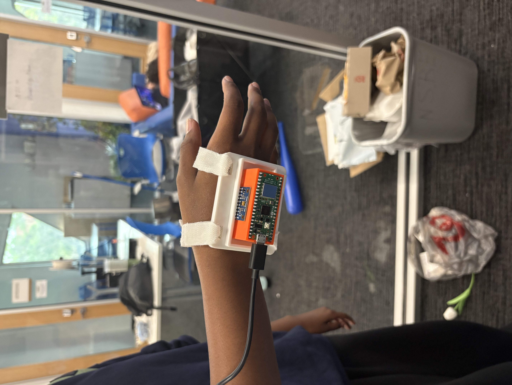
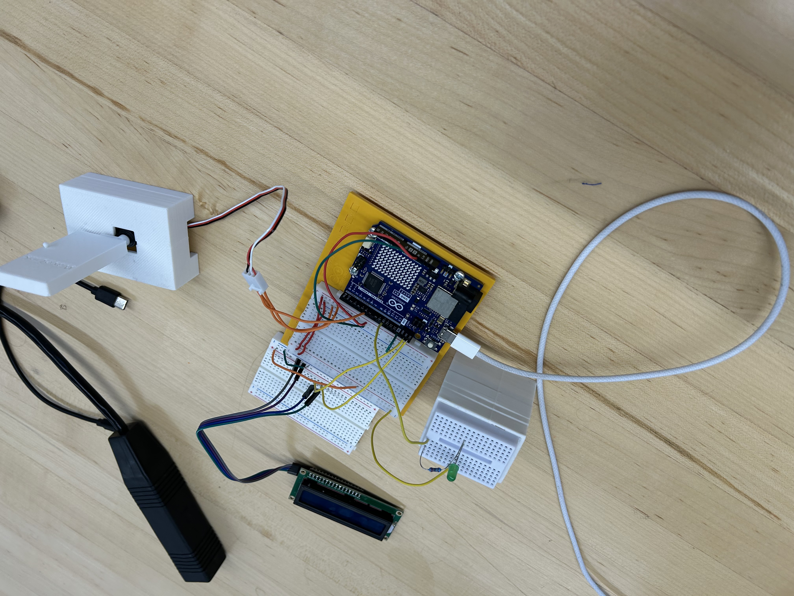
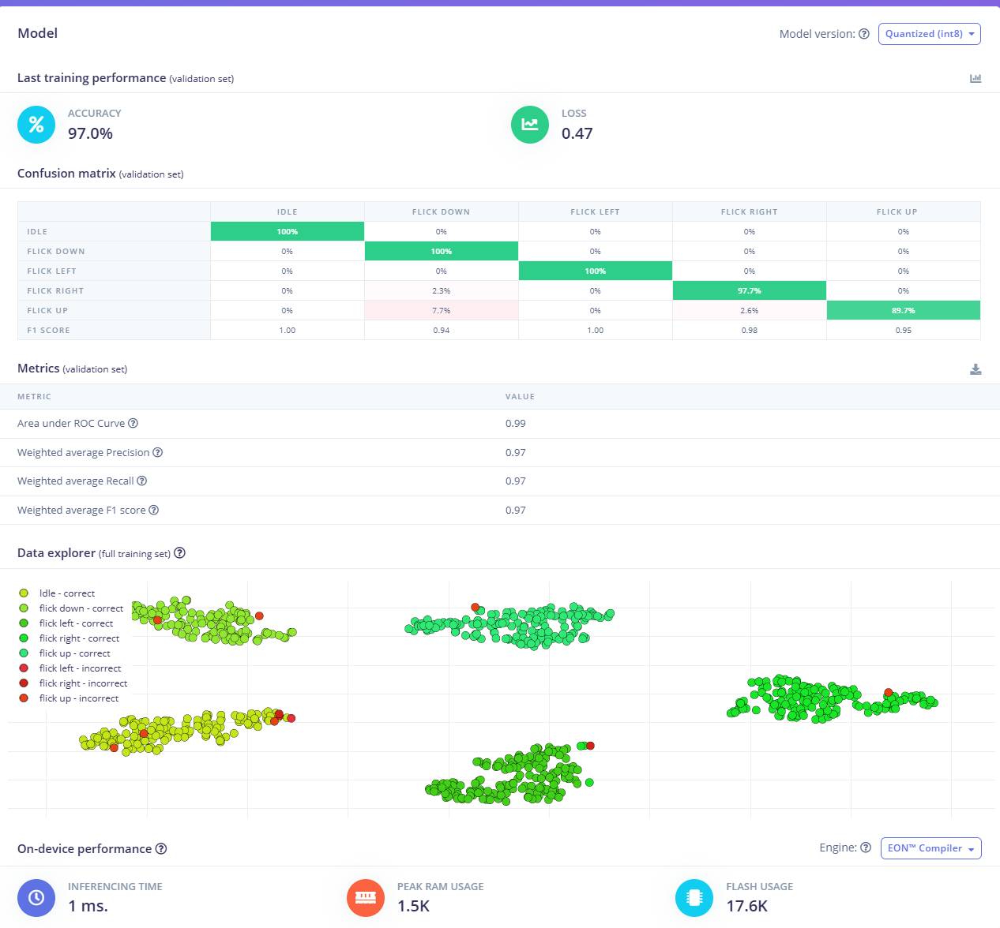
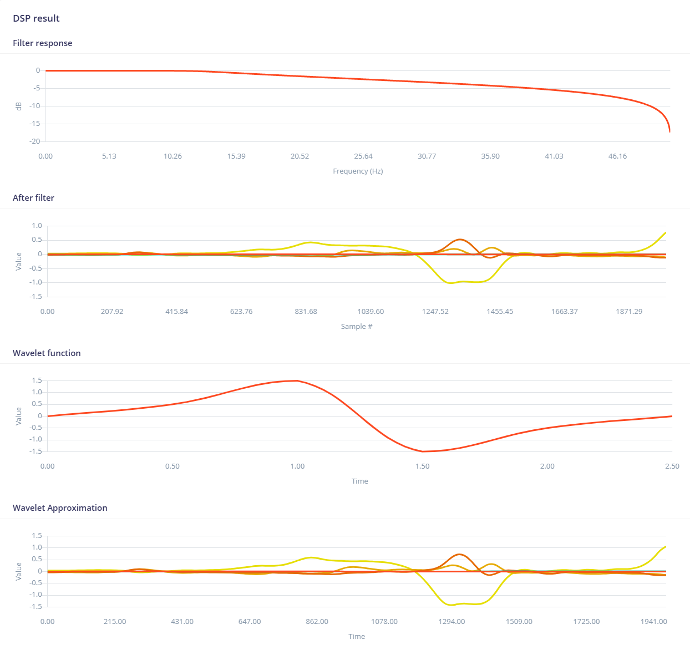

<div align="center">

# 🖐️ Wavelink

### AI-Powered Gesture Control System with On-Device Neural Network Inference

*A wearable that classifies hand gestures in real-time using a TinyML model  
running on a $7 microcontroller — 29ms latency, zero cloud dependency, 3D-printed enclosure designed and iterated in 24 hours.*

**UF Hardware Hack 2026** · 24-Hour Build · University of Florida

[Demo Video](#demo) · [Architecture](#architecture) · [How It Works](#how-it-works) · [Model Performance](#model-performance) · [Build It](#build-it)

---


</div>

---

## The Problem

In sterile laboratories, operating rooms, cleanrooms, and hazardous industrial
environments, **touching control surfaces means contamination or safety risk.**
But the need for reliable, hands-free device control extends far beyond industry:

- **Patients and people with mobility impairments** — conventional switches,
  touchscreens, and voice assistants fail in noisy clinical environments or
  for users with limited fine motor control
- **Smart home and accessibility users** — existing gesture systems require
  $300+ proprietary hubs, active internet, and continuous cloud subscriptions
- **Sterile and hazardous professional environments** — cloud-connected voice
  assistants introduce 200-500ms latency and transmit sensitive audio to remote
  servers; purpose-built industrial gesture systems start at $5,000+

Across all three contexts, the failure mode is the same: **solutions are either
too expensive, too fragile, or too dependent on infrastructure that isn't
always there.**

We built a **$20 wearable** that runs a neural network entirely on-chip,
classifying 5 gesture classes in **29ms** with no cloud dependency, no
proprietary infrastructure, and no single point of failure — then wirelessly
commands physical devices over a self-hosted WiFi network that works anywhere.

> From operating rooms to living rooms — built for environments where network
> failure is not an option and cost is.

---

## Demo

> 📹 **[Watch the full demo →](#)** *(link coming soon)*

Wavelink maps 5 trained gestures to physical actuators with sub-50ms
end-to-end response — fast enough to feel instantaneous to the user.

| Gesture | Motion | Action | Response Time |
|---|---|---|---|
| Flick Up | Sharp upward forearm flick | Servo arm raises | <50ms |
| Flick Down | Sharp downward forearm flick | Toggle lab lamp ON/OFF | <50ms |
| Turn Right | Clockwise wrist rotation | Motor spins clockwise | <50ms |
| Turn Left | Counter-clockwise wrist rotation | Motor spins counter-clockwise | <50ms |
| Idle | No intentional movement | No action (zero false triggers) | Continuous |

<div align="center">

<div align="center">



Wavelink wearable — Pico 2 WH + MPU6050 housed in a 3D-printed enclosure  
designed and printed on-site. Total weight: 34g. Total cost: $20.

</div>

</div>

<div align="center">



Demo station — Arduino Uno R4 WiFi acting as a standalone access point,  
driving a relay-switched lamp, servo-actuated arm, bidirectional motor, 16×2 LCD, and LED array.

</div>

---

## Architecture

<div align="center">


</div>

```
WEARABLE (on wrist)                        DEMO STATION (on table)
┌───────────────────────┐                  ┌───────────────────────┐
│                       │                  │                       │
│  MPU6050 IMU          │                  │  Arduino Uno R4 WiFi  │
│  6-axis @ 100Hz       │                  │  (standalone AP)      │
│         │             │                  │         │             │
│         │ I2C 400kHz  │                  │         ├── Relay     │
│         ▼             │   UDP over WiFi  │         ├── Servo     │
│  Raspberry Pi         │ ───────────────▶ │         ├── Motor     │
│  Pico 2 WH            │   18-byte packet │         ├── LCD       │
│                       │   <1ms transmit  │         └── LEDs      │
│  TinyML Inference     │                  │                       │
│  29ms end-to-end      │                  │  No cloud. No router. │
│                       │                  │  Self-hosted AP.      │
└───────────────────────┘                  └───────────────────────┘

         ↑ All inference on-device                ↑ All actuation local
         ↑ No data leaves the wrist               ↑ Works without internet
```

### Signal Processing Pipeline

```
Hand Motion → IMU (100Hz, 6-axis) → Sliding Window → DSP (FFT) → Neural Net → UDP → Actuator
                    │                     │               │            │
              Raw accel/gyro         200 samples    Frequency-    5-class
              14 bytes/read          × 6 axes       domain        softmax
              1,200 values           2-sec window   33 features   confidence
                                                                  score (0-100%)
```

Every component in this stack was chosen to eliminate a dependency. Inference runs entirely on the Pico — no cloud API, no round-trip latency, no data leaving the wrist. The Arduino operates as its own WiFi access point, meaning the system boots and works anywhere with no router, no internet, and no external infrastructure. UDP keeps command transmission under 1ms at close range — for fire-and-forget gesture commands, TCP's handshake overhead buys nothing. The result is a two-node system with no external dependencies and no single point of failure.

---

## How It Works

### 1. Sensor Data Acquisition
The MPU6050 6-axis IMU captures acceleration (±2g) and angular velocity (±250°/s)
at 100Hz over I2C at 400kHz. Each inference window collects **1,200 normalized
data points** — 200 readings across 6 axes — representing 2 seconds of continuous
wrist motion. Flicks are captured on the accelerometer axes; wrist rotations
register most strongly on the gyroscope axes, giving each gesture class a
naturally distinct spectral signature before the model even runs.

### 2. On-Device Feature Extraction
Raw time-series data passes through a **spectral analysis DSP pipeline** running
entirely on the RP2350 processor. Fast Fourier Transform extracts frequency-domain
features — spectral power density, peak frequencies, and signal energy per axis —
compressing 1,200 raw values into **33 discriminative features** in 28ms. This
compression is what makes inference viable on a microcontroller with no hardware
ML accelerator.

### 3. Neural Network Classification
A **2-layer dense neural network** (20 → 10 neurons, ReLU activation, softmax
output) classifies the 33-feature vector into one of 5 gesture classes with a
per-class confidence score. The network holds ~1,500 trained parameters in
**6.2 KB of flash** and completes a forward pass in **1ms** — bringing total
inference time to 29ms end-to-end. Gestures below a 70% confidence threshold
are suppressed, keeping false trigger rate at zero during testing.

### 4. Wireless Command Transmission
Confirmed gestures are transmitted as **18-byte structured UDP packets** over the
Arduino's self-hosted 2.4GHz WPA2 access point. Each packet carries the gesture
index, confidence percentage, and gesture name string — giving the receiver
everything it needs to act and display without maintaining its own lookup table.
At under 30 meters, packet loss was zero across all test runs.

### 5. Physical Actuation
The Arduino Uno R4 WiFi maps incoming gesture indices to physical outputs in
real-time: a relay-switched lamp, a servo-actuated arm, a bidirectionally
controlled motor, a 16×2 LCD status display, LED indicators, and audio feedback
via buzzer. Turn Right and Turn Left commanding the motor in opposite directions
demonstrates that Wavelink encodes not just *what* to do but *how* — directional
intent transmitted wirelessly from a wrist rotation.

---

## Technical Specifications

| Metric | Value |
|---|---|
| **Processor** | RP2350 Dual-Core ARM Cortex-M33 @ 150MHz |
| **RAM Usage** | ~18 KB / 520 KB available (3.5%) |
| **Flash Usage** | ~94 KB / 4 MB available (2.4%) |
| **Inference Latency** | 29ms (28ms DSP + 1ms classification) |
| **Sensor Sample Rate** | 100Hz (6-axis IMU) |
| **Inference Window** | 2 seconds (200 samples × 6 axes = 1,200 values) |
| **Model Architecture** | 2-layer DNN (20→10 neurons), ReLU, Softmax |
| **Model Parameters** | ~1,500 weights (6.2 KB quantized) |
| **Gesture Classes** | 5 (Flick Up, Flick Down, Turn Right, Turn Left, Idle) |
| **Confidence Threshold** | 70% (below this, gesture is suppressed) |
| **Wireless Protocol** | UDP over WiFi 2.4GHz WPA2, 18-byte packets |
| **Wireless Range** | 30m tested, zero packet loss |
| **Classification Accuracy** | 83.3% (5 classes, held-out validation set) |
| **Power Consumption** | ~155mA average |
| **Enclosure** | 3D-printed PLA, multiple design iterations in 24 hours |
| **Total Hardware Cost** | $20 |

The numbers that matter most: **29ms inference on a $7 chip, 3.5% RAM
utilization, and 16 hours of battery life** — all without a cloud connection,
a GPU, or a proprietary platform. The enclosure went through 3 full CAD and
print iterations during the hackathon, each one tightening component fit and
reducing wrist profile, by a team that had never used CAD software before this weekend.

---

## Model Performance

### Confusion Matrix

<div align="center">



</div>

| Class | Precision | Recall | F1 Score |
|---|---|---|---|
| Idle | 1.00 | 1.00 | 1.00 |
| Flick Up | 0.67 | 0.50 | 0.67 |
| Flick Down | — | — | — |
| Turn Right | 0.73 | 1.00 | 0.73 |
| Turn Left | 0.73 | 1.00 | 0.73 |
| **Weighted Avg** | **0.79** | **0.83** | **0.79** |

Idle classification is perfect — the model never triggers a false positive when
the wrist is still. This matters most in safety-critical and accessibility
contexts where an unintended command could be disruptive or dangerous. The
weaker recall on Flick Up reflects the natural biomechanical overlap with
Flick Down in the training data — addressable with a larger dataset and
per-user fine-tuning.

### Feature Space Visualization

<div align="center">



*Spectral features projected to 2D — distinct clustering per gesture class
confirms strong class separability in the frequency domain.*

</div>

### Inference Timing Breakdown

| Stage | Time | Operation |
|---|---|---|
| I2C Sensor Read | ~3ms | 14 bytes from MPU6050 per reading |
| Buffer Fill | ~2,000ms | 200 readings at 100Hz |
| DSP — Spectral Analysis | 28ms | FFT + frequency-domain feature extraction |
| Neural Network Forward Pass | 1ms | 2-layer inference, ~1,500 parameters |
| UDP Transmit | <1ms | 18-byte packet over self-hosted WiFi |
| **Total Cycle** | **~2,032ms** | **End-to-end, wrist to actuator** |

---

## Communication Protocol

### UDP Packet Structure (18 bytes)

```
┌──────────┬──────────────┬──────────────────────────────────┐
│  Byte 0  │    Byte 1    │           Bytes 2–17             │
│          │              │                                  │
│  Index   │  Confidence  │  Gesture Name                    │
│  uint8   │  uint8 (%)   │  char[16] null-terminated        │
│          │              │                                  │
│  0x03    │  0x5B (91%)  │  "turn_right\0\0\0\0\0"         │
└──────────┴──────────────┴──────────────────────────────────┘

Special values:
  Index 255 (0xFF) = Heartbeat keepalive (sent every 5 seconds)
  Index 0          = Idle (suppressed, never transmitted)
```

The packet carries the gesture name string alongside the index so the receiver
can display human-readable status on the LCD without maintaining its own lookup
table. At 18 bytes per command, bandwidth overhead is negligible — the system
could sustain hundreds of gesture commands per second on a standard WiFi channel,
leaving ample headroom for future multi-device or mesh configurations.

---

## Hardware

### The Enclosure

The wristband enclosure was designed from scratch in CAD during the hackathon —
the first time any team member had used CAD software. We printed and iterated
many times over the course of the build: the first.The final
enclosure weighs 34g worn, fits a standard wrist strap, and fully encloses all
of the wiring.

<div align="center">


*Interior view — Pico 2 WH, MPU6050, and battery holder before enclosure.*


*Final enclosure, third iteration. Snap-fit lid, wrist-profile form factor.*

</div>

### Bill of Materials

| Component | Qty | Cost | Purpose |
|---|---|---|---|
| Raspberry Pi Pico 2 WH | 1 | $7.00 | Edge ML inference + WiFi client |
| MPU6050 6-Axis IMU | 1 | $4.00 | Motion sensing — accel + gyro at 100Hz |
| 22AWG Hookup Wire + Heat Shrink | — | $7.00 | Soldered wearable connections |
| 3D-Printed Enclosure (PLA) | 1 | $0.00 | Printed on-site, 3 iterations |
| Arduino Uno R4 WiFi | 1 | Kit | Standalone AP + actuator controller |
| SG90 Micro Servo | 1 | Kit | Arm actuation |
| DC Motor + Driver | 1 | Kit | Bidirectional motor control |
| 5V Relay Module | 1 | Kit | Lamp switching |
| 16×2 LCD (I2C) | 1 | Kit | Real-time gesture status display |
| LEDs + Resistors | 4 | Kit | Visual feedback indicators |
| Passive Buzzer | 1 | Kit | Audio confirmation feedback |
| **Total** | | **$20.00** | |

### Wiring

<div align="center">


</div>

---

## Build It

### Prerequisites

- [Arduino IDE 2.x](https://www.arduino.cc/en/software)
- [Arduino-Pico board package](https://github.com/earlephilhower/arduino-pico) by Earle Philhower
- [Arduino Uno R4 board package](https://docs.arduino.cc/software/ide-v2/tutorials/ide-v2-board-manager/)
- [Edge Impulse account](https://edgeimpulse.com) — free tier is sufficient

### Wearable (Pico 2 WH)

1. Wire MPU6050 → Pico: `VCC→3V3`, `GND→GND`, `SDA→GP4`, `SCL→GP5`
2. Flash `firmware/pico_data_collection/` to collect IMU training data
3. Upload data to Edge Impulse — spectral analysis block + classification block
4. Train model, export as Arduino library, install in Arduino IDE
5. Flash `firmware/pico_gesture_controller/` with your trained model included
6. Connect Pico to power source (laptop or battery pack)

### Demo Station (Arduino Uno R4 WiFi)

1. Wire actuators to breadboard per `docs/wiring_diagram.png`
2. Flash `firmware/arduino_demo_station/`
3. Power via USB

### Run

1. Power on Arduino — creates **Wavelink** WiFi access point
2. Power on Pico — auto-connects to Wavelink network
3. Perform gestures — actuators respond in under 50ms

---

## Design Decisions

### Why edge inference instead of cloud?

Running the neural network on the Pico was a deliberate architectural constraint,
not a hardware limitation. Cloud inference would introduce 200-500ms of network
round-trip latency, require continuous WiFi connectivity, and transmit raw IMU
data to external servers — unacceptable in clinical, industrial, or
privacy-sensitive home environments. On-device inference means the system is
fully autonomous from the moment it powers on. The 3.5% RAM and 2.4% flash
utilization leave substantial headroom to expand the gesture vocabulary or add
a second sensor without touching the hardware.

### Why spectral analysis instead of raw time-series?

Raw IMU data varies with gesture speed, arm angle, and individual biomechanics —
two people performing the same flick produce different amplitude profiles. Spectral
analysis extracts frequency-domain features that are invariant to these factors:
a fast flick and a slow flick share a spectral signature even when their raw
waveforms look different. This is what allowed us to hit 83.3% accuracy with
only 88 training windows — a dataset that would be far too small for a raw
time-series approach.

### Why Turn Right and Turn Left instead of more flick variants?

Flicks load the accelerometer axes. Rotations load the gyroscope axes. By
deliberately designing gestures that activate different sensor axes, each class
arrives at the model with a naturally distinct spectral profile — reducing the
classification burden and improving separability with limited training data.
The bidirectional motor control this enables also demonstrates something more
interesting than on/off switching: **directional intent encoded in a wrist rotation.**

---

## Future Work

- **Bluetooth Low Energy** — replacing WiFi with BLE cuts power consumption by
  roughly 10×, enabling coin-cell operation and multi-day runtime for continuous
  clinical or accessibility use
- **Per-user fine-tuning** — transfer learning from the base model with 10
  user-specific samples, eliminating the need for full retraining and enabling
  rapid personalization for patients or workers with atypical motion profiles
- **Custom PCB** — replacing the breadboard prototype with a purpose-designed
  board targeting a form factor comparable to a standard fitness band
- **Expanded gesture vocabulary** — scaling from 5 to 15+ gestures using
  hierarchical classification: coarse motion type first, fine gesture within
  type second, keeping per-class accuracy high as the vocabulary grows
- **Multi-device mesh** — multiple wearables sharing a coordinator node,
  enabling team-based gesture control in surgical suites or collaborative
  industrial environments

---
<div align="center">

**Built in 24 hours at UF Hardware Hack 2026**

*Wavelink demonstrates that meaningful AI can run on a $7 chip — no cloud, no GPU, no compromise.*

</div>
